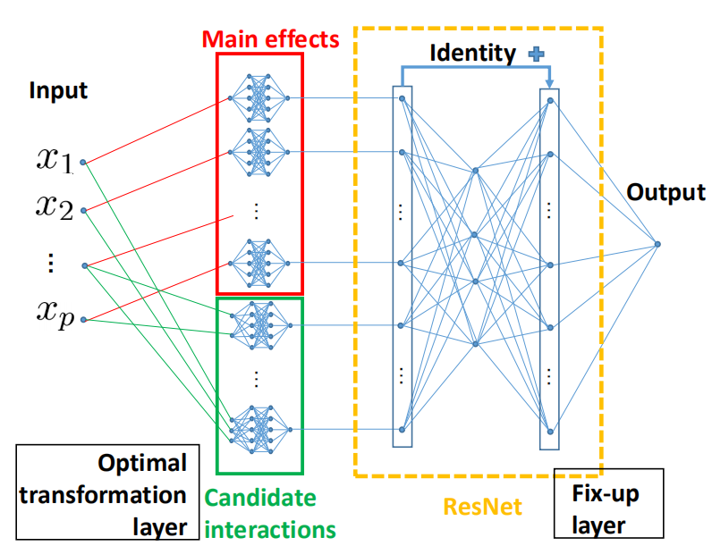

# Fast Generic Interaction Detection for Model Interpretability and Compression

This repository is the official implementation of [Fast Generic Interaction Detection for Model Interpretability and Compression]. The code mainly relies on the MXNet package, for those who are not familiar with MXNet, we also provide a PyTorch demo for the interaction detection task. 

> We cast the interaction detection problem as a multi-arm bandits problem, and use the detected interactions to build a lightweight and interpretable model named ParaACE. 
> 


## Requirements 

### Requirements for the demo (PyTorch)

python==3.6.3

networkx==2.3

numpy==1.16.4

matplotlib==3.1.1

torch==1.1.0

If you have installed latest Anaconda already, then you only need to install the PyTorch additionally. 

For practitioners who don't have GPU devices and for those who are not familiar with MXNet, we provide a demo for the interaction detection with UCB algorithm implemented in PyTorch.


### Requirements for our main experiments (MXNet)
python==3.6.3

mxnet-cu90==1.4.1 

networkx==2.3

numpy==1.16.4

matplotlib==3.1.1

pandas==0.24.2

scikit-learn==0.21.2

scipy==1.2.1

This implementation needs GPU support, please install the packages according to your own NVIDIA driver setting. For latest MXNet version, please add `ctx=ctx` while loading the parameters.

*Make sure that you have at least 10 GB of free space available on the hard disk.*

## Datasets

### Synthetic datasets

The synthetic datasets come from the functions in Tsang's paper. Run the codes in the folder `gen_synthetic_data` to generate the data. The data is in the `csv` form, the last column of which is the target.

### Real datasets

The real datasets are public available. 

Elevator https://www.dcc.fc.up.pt/~ltorgo/Regression/DataSets.html

Parkinsons https://archive.ics.uci.edu/ml/datasets/Parkinsons+Telemonitoring

Skillcraft http://archive.ics.uci.edu/ml/datasets/SkillCraft1+Master+Table+Dataset

Bike sharing http://archive.ics.uci.edu/ml/datasets/Bike+Sharing+Dataset

Cal housing https://www.dcc.fc.up.pt/~ltorgo/Regression/DataSets.html

Drug combination https://zenodo.org/record/4135059

## Usage

Different experiments are conducted in different folders. 

You only need to enter the interested folder and activate your environment. You should first check all the datasets are in the `regression` folder.

Then, run the following command:
```
python main.py
```
It will automatically generate the `result.csv` file containing the comparison of different methods as well as the model files.

To visualize the detected interactions, you may open the `.ipynb` files and run the corresponding cells.

### Comparison with LTH

Run the following command:
```
python LTHmain.py
```

You can visualize the results from the `.ipynb` file.
